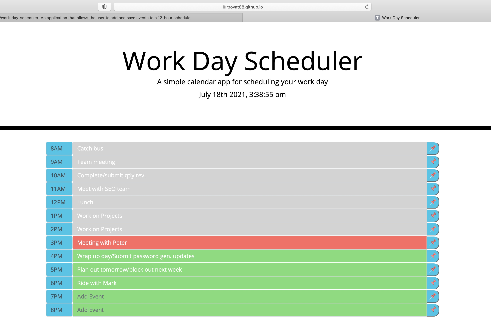
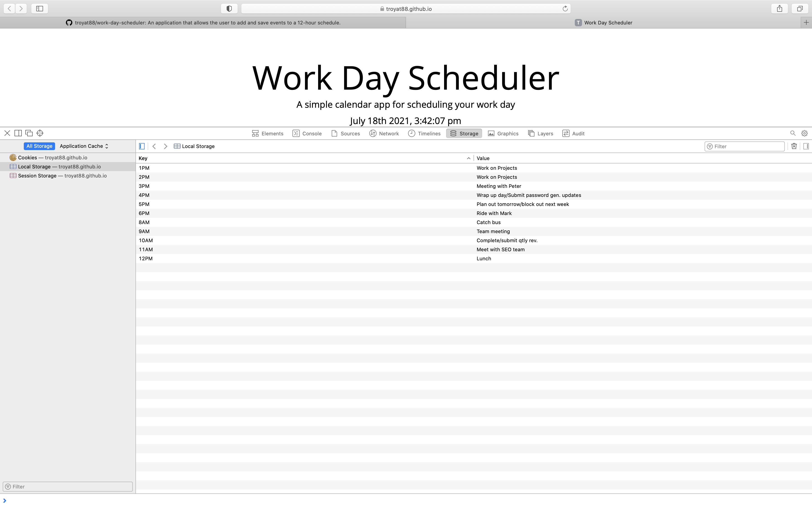

# Third-Party APIs: Work Day Scheduler

### Link to final producr: https://troyat88.github.io/work-day-scheduler/

## Task

Modify client code for Calendar App, that allows for user to save events by hour. This app will run in the browser and feature dynamically updated HTML and CSS powered by jQuery.
---

## Acceptance Criteria

1. Current day is displayed at the top of the calendar

2. Present with timeblocks for standard business hours

3. Each time-block is color coded to indicate whether it is in the past,  present, or future

4. Enable user to be able to click into a time-block and enter event

5. Save button on each time-block saves event to local storage

6. Events do not clear if page is reset

## Developement Procedure 

1. Use Moments.js library to dynamically update time for calendar, as well as to evaluate variables and local storage items for calendar functionality

2. Time-blocks elements created with Bootstrap API

3. Color code established dynamically by comparing fixed time-blocks with actual time via Moments.js

4. Event saving and persistance in time-block enabled through variables interracting with Moments.js and local storage

5. Added hover effects for entry field visibilty and UI/UX improvent

6. Updated save-button icons and added favicon

## Final Product

 
---
 